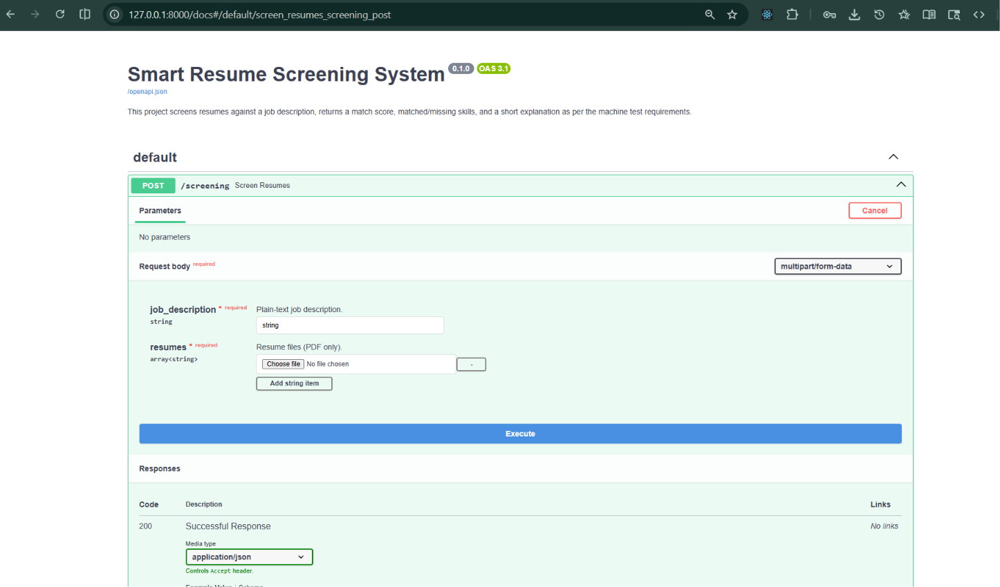
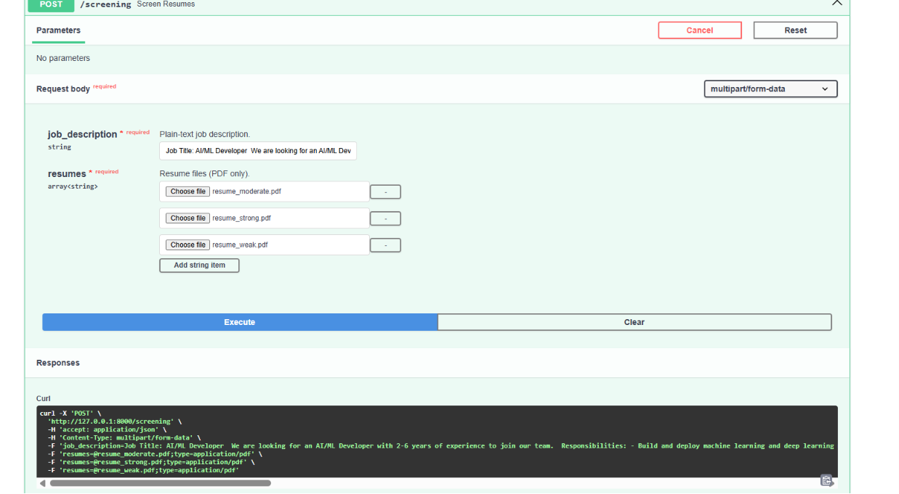
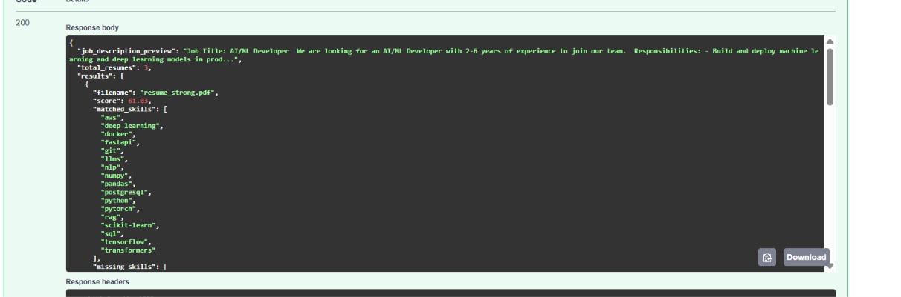

# Smart Resume Screening System (AI-Powered)

This project screens resumes against a job description and returns a match score, matched/missing skills, and a short explanation.

## Prerequisites

- Python 3.14
- uv (Python package manager)
  https://astral.sh/uv
- Azure OpenAI API key and endpoint (for embeddings and structured parsing): https://ai.azure.com/

## How to set up and run the app

1. Clone the repository:

```bash
git clone git@github.com:GajendrasinghDawar/resume-screening-system-MXPERTZ.git
cd resume-screening-system-MXPERTZ
```

2. Create a local `.env` file from `.env.example` and set `AZURE_API_KEY`. If your deployments or endpoint differ, update these constants in `app/ai_client.py`:

- EMBEDDING_MODEL
- CHAT_MODEL
- AZURE_ENDPOINT

3. Create the environment and install dependencies:

```bash
uv sync
```

4. Run the API:

```bash
uv run uvicorn app.main:app --reload
```

5. Open the docs:

```
http://127.0.0.1:8000/docs
```

## Testing via /docs

1. Start the app and open http://127.0.0.1:8000/docs
2. Expand `POST /screening` and click "Try it out".
3. Paste a job description in `job_description`.
4. Upload one or more PDF files in `resumes`.
5. Click "Execute" and review the JSON response.

Screenshots for the docs flow are stored in the `assets/` folder.





## Code walkthrough

The code is organized into `app/`.

```
├── app/main.py     -> FastAPI endpoint, validation, file handling
├── app/parser.py   -> PDF text extraction + LLM structured parsing
├── app/matcher.py  -> Embeddings + cosine similarity, returns matched/missing skills
└── app/utils.py    -> Helper functions
```

## Approach explanation

We use an embedding-based approach to measure semantic similarity between the job description and the uploaded resume text; this captures meaning beyond exact keyword matches.

**How it works:** we first capture the job description and the text extracted from the uploaded resume PDF. Then we use Azure OpenAI to generate the structured data we need (skills and experience) from both the job description and the resume text. After that, we compute embeddings for the job description and the resume text and calculate cosine similarity to get a score. Finally, we return the score, matched/missing skills, and a short explanation.

**Edge cases:** large PDFs and synchronous parsing can slow requests because parsing runs in the request path (no background job/queue in this minimal version).
